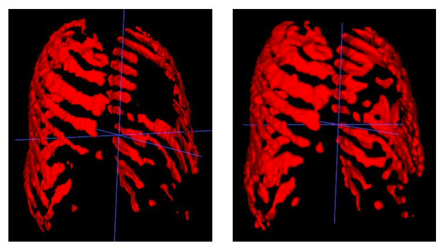

# Outlier detection

This is the repository of an interdisciplinary project on the topic of automated outlier detection in organ and bone segmentation with shape reconstruction.

Student: Tomislav Pavković<br />
Advisor: Robert Graf<br />
Supervisor: Jan Kirschke<br />

All subfolders (preprocessing, evaluation, if-net) have their own README file with instructions for running the program.

## Motivation

Segmentation in medicine refers to the process of identifying and delineating specific structures or regions of interest within medical images, such as CT scans, MRI images, or X-rays. It involves the precise outlining or labeling of anatomical structures, tumors, organs, or tissues to separate them from the background or other structures. Medical image segmentation is crucial for accurate diagnosis, treatment planning, and quantitative analysis in various medical applications.

For efficient biomarker selection, automated segmentation of large epidemiological cohorts is essential, since it’s difficult to manually verify a huge number of scans.

To solve this problem, the goal of the project was to enhance the automated segmentation process through the utilization of Neural Implicit Representation techniques to learn the shape prior.

## Dataset

The dataset used for this project consists of the TotalSegmentator project’s ground truth and its predictions, and the German national cohort’s predicted Abdomen segmentation.
The dataset contains CT scans of human body, where each scan contains a few organ segmentations. All segmentations are 3D shapes with voxel size of 1.5 mm in all dimensions. It consists of 4739 CT scans. 

The biggest challenges with the dataset were: inconsistent organ labeling in datasets, inconsistent organ selection in scans, varying organ size and complexity, incomplete organs and bad segmentations.

In order to solve the inconsistent organ selection in the scans, and since it’s easier and more accurate to work with each organ independently, the model was trained on individual organs chosen based on size, complexity and tissue type.

There are pretrained models available for right kindey, liver, pancreas and right hip [here](https://drive.google.com/drive/folders/1G4yvbw-ClqmgoQ3VOxddSx0gK_nTQLlo?usp=sharing).

## Solution

To solve the outlier detection problem in this project, shape priors were used to incorporate prior knowledge about typical shapes of organs or structures.
Shape reconstruction is used to obtain the ideal object shape. After the reconstruction, chosen metrics are calculated to compare the input and the reconstruction and determine the outliers based on the metrics score. This way it is possible to locate the defect by visually comparing the input and the reconstruction.

In order to reconstruct the ideal organ shape, Neural Implicit Representation model was used.
Software for automatic analysis of CT scans compares the segmentation and the reconstruction using metrics like Dice score, Hausdorff distance, Average Surface Distance or Maximal Distance and setting a threshold for the outliers.

## Data preprocessing

To start the training some preprocessing is needed. Extraction of the single organ requires knowing the segmentation label of that organ. That information is contained in an Excel spreadsheet as the organs in column names are ordered the same way as segmentation labels. After getting the segmentation label for the chosen organ in each group the segmentation is extracted, the object is centered and the image is resized as the model input resolution is 128 voxels in each dimension. 

Incomplete organ segmentations are filtered out.

The format then needs to be converted from NIfTI to numpy array and the boundary sampling needs to be done.

## Data augmentation

The first augmentation implemented is a so-called online or on-the-fly data augmentation method which adds a cube of random size and crops a cube of random size out of the input shape during each training iteration. 
Since it is a very fast process it is beneficial to do it on the fly because that way it can add different deformations to the same input in different epochs of the training.

To add a more random shape, because a cube is not a natural and expected shape in the organ, second augmentation uses Perlin noise by creating a Perlin noise in a space the same size as the input image and keeping the values above the certain threshold, that way creating a random shapes in the space. Then created random shapes are added and deleted from the original organ shape.

Because the organ size varies it is more effective to add shapes only to the close proximity of the organ and that way the deletion also works better since there is a higher probability of the random shapes actually overlapping with the organ shape. Third augmentation restricts the area for shape generation to the size of the object plus a few voxels on all sides.

The third augmentation showed the best results and is recommended.


Since the Perlin noise generation is a time-consuming process it is done offline, meaning a deformed image is generated for each scan before the training.

## Reconstructions

When comparing reconstructions with the input and the ground truth it is visible that the model successfully fixes both undersegmentation and oversegmentation. Even though it is not always perfectly reconstructed compared to the ground truth, it generally recognizes segmentation errors and deforms the part enough that it is later recognized as an outlier.

For oversegmentation, it is more successful with smaller deformations and deformations that are further away from the object.


Reconstructions are usually better for the organs that have a similar shape in every scan, for example, bones, but the model performed reasonably well for the pancreas too, for which the segmentation shapes are very inconsistent across the scans. 

An experiment with multi-organ segmentations was performed on the segmentations of ribs. Since the whole rib cage is very big and the resolution of the model’s input is limited to 128 voxels, segmentations had to be severely downscaled which made the bones pixelated or even detached on the thin parts. The model still managed to learn the general shape and in the example with a big hole in the rib cage, it noticed that hole and added some shapes which don’t really complete the bones.



## Metrics and outliers

For the comparison of input and output, Dice score, Average surface distance, 95% Hausdorff distance and Maximum distance were calculated but the Dice score showed the best differentiation between good and bad reconstructions which is why it is recommended for calculating the outlier threshold based on the certain percentage of worst dice scores. 

## Conclusions

After the inspection of detected outliers, the model seems successful. With a cleaner dataset, the model could be more successful and more precise both in the reconstruction and the outlier detection. 

During the hyperparameter tuning process, data augmentation proved to be very important and made the biggest difference on the results. In the case of multi-organ segmentation, it was shown that the current resolution of 128 voxels in all dimensions is not sufficient for a successful reconstruction. 

## Next steps

Some promising steps for future work would include training the model on the cleaner dataset. It would also be interesting to try some other reconstruction models.
It could also be useful to find a faster algorithm for noise creation to be able to use it as an on-the-fly method.

For the multiorgan reconstruction, adapting the model for a higher input resolution would most likely be beneficial.
Lastly, training the model on all other organs to be able to provide a pretrained model, ready for use.

## Optimal hyperparameters

The optimal hyperparameters are set in the config files.
For training the model following hyperparameters were used:

Learning rate: 1e-4<br />
Optimizer: Adam<br />
Adam weight decay: 1e-5<br />
Pointcloud samples: 3000<br />
Sample distribution: [0.5, 0.5]<br />
Sample sigmas: [0.1, 0.01]<br />
Batch size: the biggest that can fit in GPU (10 was used)<br />
Augmented: True<br />

Preprocessing parameters:

Boundary sampling sigmas: [0.1, 0.01]<br />
Boundary sampling sample number: 100000<br />
Perlin noise augmentation (deform_input.py):<br />
    threshold minimum: 0.65<br />
    threshold maximum: 1<br />

Outlier detection (analyse_image.py) parameters:

metrics: ['dice score']

Evaluation parameters:

outlier_percentage: 0.05

## Installation
Create a new conda environment by executing the following command:
```shell
conda env create --name evaluation --file=env.yml
```

Now, activate the new environment:
```shell
conda activate outlier-detection
```
