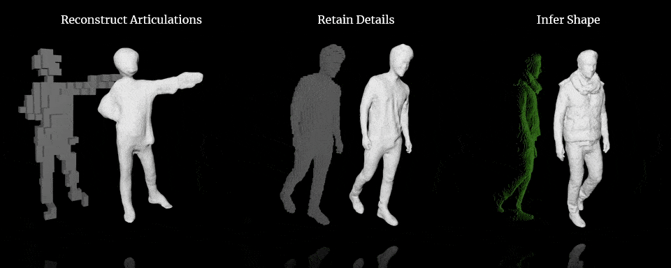

# Deep Feature Grids Network
> Implicit Functions in Feature Space for Shape Reconstruction and Completion <br />
> [Julian Chibane](http://virtualhumans.mpi-inf.mpg.de/people/Chibane.html), [Thiemo Alldieck](http://virtualhumans.mpi-inf.mpg.de/people/alldieck.html), [Gerard Pons-Moll](http://virtualhumans.mpi-inf.mpg.de/people/pons-moll.html)



[Paper](https://virtualhumans.mpi-inf.mpg.de/papers/chibane20ifnet/chibane20ifnet.pdf) - 
[Supplementaty](https://virtualhumans.mpi-inf.mpg.de/papers/chibane20ifnet/chibane20ifnet_supp.pdf) -
[Project Website](https://virtualhumans.mpi-inf.mpg.de/ifnets/) -
[Arxiv](https://arxiv.org/abs/2003.01456) -
[Video](https://youtu.be/cko07jINRZg) -
Published in CVPR 2020.


#### Citation

If you find our code or paper usful for your project, please consider citing:

    @inproceedings{chibane20ifnet,
        title = {Implicit Functions in Feature Space for 3D Shape Reconstruction and Completion},
        author = {Chibane, Julian and Alldieck, Thiemo and Pons-Moll, Gerard},
        booktitle = {{IEEE} Conference on Computer Vision and Pattern Recognition (CVPR)},
        month = {jun},
        organization = {{IEEE}},
        year = {2020},
    }

## Install

If outlier-detection environment was installed from the env.yml in the root directory you can skip if-net_env.yml installation.

A linux system with cuda 9.0 is required for the project.

The `if-net_env.yml` file contains all necessary python dependencies for the project.
To conveniently install them automatically with [anaconda](https://www.anaconda.com/) you can use:
```
conda env create -f if-net_env.yml
conda activate if-net
```

Please clone the repository and navigate into it in your terminal, its location is assumed for all subsequent commands.

> This project uses libraries for [Occupancy Networks](https://github.com/autonomousvision/occupancy_networks) by [Mescheder et. al. CVPR'19] 
> and the ShapeNet data preprocessed for [DISN](https://github.com/Xharlie/DISN) by [Xu et. al. NeurIPS'19], please also cite them if you use our code.

Install the needed libraries with:
```
cd data_processing/libmesh/
python setup.py build_ext --inplace
cd ../libvoxelize/
python setup.py build_ext --inplace
cd ../..
```
In the following files change the path in the sys.path.append() line to your path to the data_processing directory: data_processing/create_voxel_off.py, data_processing/voxels.py,<br /> 
and to path to the if-net directory in data_processing/implicit_waterproofing.py file.

## Data Preparation
For Deep Feature Grids Network images of size 128x128x128 voxels are used. To prepare your dataset, use the scripts from preprocessing package.

For all the following steps parameters are specified in ifnet_config.yaml file.

As a first step you need to extract the needed data out of NIfTI format with the following command
```
python data_processing/voxelize_from_nifti.py
```
Then you need to convert the data to off format for boundary sampling with the following command
```
python data_processing/create_voxel_off.py
```
Next step requires different filename so you shoud run following command
```
python data_processing/rename_voxel_off.py
```

Training input points and the corresponding ground truth occupancy values are generated with
```
python data_processing/boundary_sampling.py
```
If you want to use Perlin noise thresholding data augmentation, run the following command
```
python data_processing/deform_input.py
```
To create training, validation and test splits run the command
```
python data_processing/create_splits.py
```

## Training
The training of IF-Nets is started running
```
python train.py
```
where the sigmas to use, input resolution (32<sup>3</sup> or 128<sup>3</sup>), the IF-Net model setup
+ ShapeNet32Vox for 32<sup>3</sup> voxel Super-Resolution experiment
+ ShapeNet128Vox for 128<sup>3</sup> voxel Super-Resolution experiment
+ ShapeNetPoints for Point Cloud Completion experiments
+ SVR for 3D Single-View Reconstruction

and the number of different meshes inputted in a batch, each with 50.000 point samples (=6 for small GPU's) are specified in ifnet_config.yaml. 

Consider using the highest possible `batch_size` in order to speed up training.

In the `experiments/` folder you can find an experiment folder containing the model checkpoints, the checkpoint of validation minimum, and a folder containing a tensorboard summary, which can be started at with
```
tensorboard --logdir experiments/YOUR_EXPERIMENT/summary/ --host 0.0.0.0
```

The training should be done with ground truth dataset.
## Generation
The command
```
python generate.py
```
generates the reconstructions of the, during training unseen, test examples from the dataset into  the folder 
```experiments/YOUR_EXPERIMENT/evaluation_CHECKPOINT_@256/generation```.
You can choose the IF-Net model checkpoint in ifnet_config.yaml. Use the model with minimum validation error for this, 
You can also choose the number of points that fit into GPU memory at once (400k for small GPU's) in the same file. Please also add all parameters set during training. 
> The generation script can be run on multiple machines in parallel in order to increase generation speed significantly. Also, consider using the maximal batch size possible for your GPU.

To generate predictions for lower resolution inputs or automated predictions you should change the data_path in ifnet_config.yaml to the folder containing the inputs before running the command.

## Post processing
After generating output you need to convert it to nifti format to evaluate it.

Output voxels are generate by running following command with output root folder of previous generation and reconstruction filename being specified in ifnet_config.yaml. 
```
python voxelize.py
```

To convert to NIfTI format you can run the following command with output root folder of previous generation, desired output folder and the original NIfTI dataset (ground truth) set as in ifnet_config.yaml.
```
python convert_to_nifti.py
```

## Evaluation
Please follow the instructions in the evaluation folder.

## Automated analysis
To detect the outliers in any dataset you can use the trained model by running
```
python analyse_image.py
```
Pretrained models should be stored in the if-net/experiments/ folder and be named by a single number corresponding to the label of the organ the model was trained on in the TotalSegmentator dataset (dictionary with label: organ mapping is stored in preprocessing/map_to_binary.py). Each model's folder should contain checkpoints/ folder containing the desired checkpoint, val_min={checkpoint}.npy created during the training, and outlier_threshold.npy created during evaluation. Multiple models trained on different organs can be used at once for analysis of multiple organs in the input image. 

Parameters should be specified in ifnet_config.yaml.

## Pretrained Models

Pretrained models can be found [here](https://drive.google.com/drive/folders/1G4yvbw-ClqmgoQ3VOxddSx0gK_nTQLlo?usp=sharing).
To run the reconstruction with downloaded models export folders named by organ label in experiments folder and specify the checkpoint number in the ifnet_config file or comment the checkpoint in the config and let the script use the optimal checkpoint specified in val_min={checkpoint}.npy file.


## License
Copyright (c) 2020 Julian Chibane, Max-Planck-Gesellschaft

Please read carefully the following terms and conditions and any accompanying documentation before you download and/or use this software and associated documentation files (the "Software").

The authors hereby grant you a non-exclusive, non-transferable, free of charge right to copy, modify, merge, publish, distribute, and sublicense the Software for the sole purpose of performing non-commercial scientific research, non-commercial education, or non-commercial artistic projects.

Any other use, in particular any use for commercial purposes, is prohibited. This includes, without limitation, incorporation in a commercial product, use in a commercial service, or production of other artefacts for commercial purposes.
For commercial inquiries, please see above contact information.

THE SOFTWARE IS PROVIDED "AS IS", WITHOUT WARRANTY OF ANY KIND, EXPRESS OR IMPLIED, INCLUDING BUT NOT LIMITED TO THE WARRANTIES OF MERCHANTABILITY, FITNESS FOR A PARTICULAR PURPOSE AND NONINFRINGEMENT. IN NO EVENT SHALL THE AUTHORS OR COPYRIGHT HOLDERS BE LIABLE FOR ANY CLAIM, DAMAGES OR OTHER LIABILITY, WHETHER IN AN ACTION OF CONTRACT, TORT OR OTHERWISE, ARISING FROM, OUT OF OR IN CONNECTION WITH THE SOFTWARE OR THE USE OR OTHER DEALINGS IN THE SOFTWARE.

You understand and agree that the authors are under no obligation to provide either maintenance services, update services, notices of latent defects, or corrections of defects with regard to the Software. The authors nevertheless reserve the right to update, modify, or discontinue the Software at any time.

The above copyright notice and this permission notice shall be included in all copies or substantial portions of the Software. You agree to cite the `Implicit Functions in Feature Space for 3D Shape Reconstruction and Completion` paper in documents and papers that report on research using this Software.
